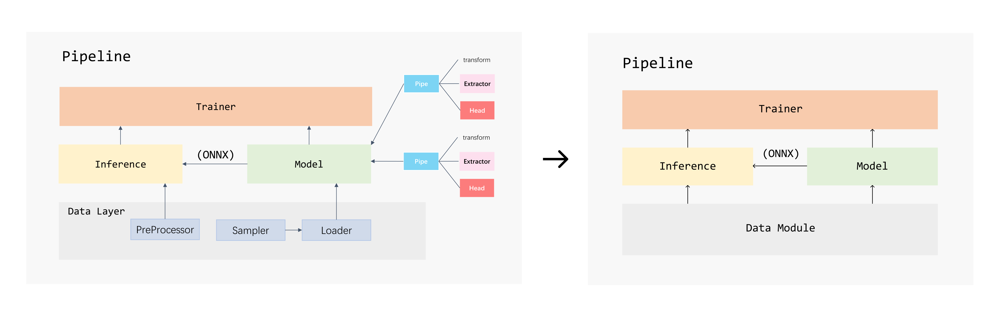

import Tabs from '@theme/Tabs';
import TabItem from '@theme/TabItem';

We're happy to announce that `carefree-learn` released `v0.2.0`, which made it capable of solving not only tabular tasks, but also other general deep learning tasks!

+ [GitHub](https://github.com/carefree0910/carefree-learn)
+ [Document](/docs)

<!--truncate-->


## Introduction

Deep Learning with [PyTorch](https://pytorch.org/) made easy 🚀!

Like many similar projects, `carefree-learn` can be treated as a high-level library to help with training neural networks in PyTorch. However, `carefree-learn` does more than that.

+ `carefree-learn` is **highly customizable** for developers. We have already wrapped (almost) every single functionality / process into a single module (a Python class), and they can be replaced or enhanced either directly from source codes or from local codes with the help of some pre-defined functions provided by `carefree-learn` (see [Register Mechanism](/docs/design-principles#register-mechanism)).
+ `carefree-learn` supports easy-to-use saving and loading. By default, everything will be wrapped into a `.zip` file, and `onnx` format is natively supported!
+ `carefree-learn` supports Distributed Training.

Apart from these, `carefree-learn` also has quite a few specific advantages in each area:

### Machine Learning 📈

+ `carefree-learn` provides an end-to-end pipeline for tabular tasks, including **AUTOMATICALLY** deal with (this part is mainly handled by [`carefree-data`](https://github.com/carefree0910/carefree-data), though):
    + Detection of redundant feature columns which can be excluded (all SAME, all DIFFERENT, etc).
    + Detection of feature columns types (whether a feature column is string column / numerical column / categorical column).
    + Imputation of missing values.
    + Encoding of string columns and categorical columns (Embedding or One Hot Encoding).
    + Pre-processing of numerical columns (Normalize, Min Max, etc.).
    + And much more...
+ `carefree-learn` can help you deal with almost **ANY** kind of tabular datasets, no matter how *dirty* and *messy* it is. It can be either trained directly with some numpy arrays, or trained indirectly with some files locate on your machine. This makes `carefree-learn` stand out from similar projects.

:::info
From the discriptions above, you might notice that `carefree-learn` is more of a minimal **Automatic Machine Learning** (AutoML) solution than a pure Machine Learning package.
:::

:::tip
When we say **ANY**, it means that `carefree-learn` can even train on one single sample.

<details><summary><b>For example</b></summary>
<p>

```python
import cflearn

toy = cflearn.ml.make_toy_model()
data = toy.data.cf_data.converted
print(f"x={data.x}, y={data.y}")  # x=[[0.]], y=[[1.]]
```

</p>
</details>
<br />

This is especially useful when we need to do unittests or to verify whether our custom modules (e.g. custom pre-processes) are correctly integrated into `carefree-learn`.

<details><summary><b>For example</b></summary>
<p>

```python {19,22}
import cflearn
import numpy as np

# here we implement a custom processor
@cflearn.register_processor("plus_one")
class PlusOne(cflearn.Processor):
    @property
    def input_dim(self) -> int:
        return 1

    @property
    def output_dim(self) -> int:
        return 1

    def fit(self, columns: np.ndarray) -> cflearn.Processor:
        return self

    def _process(self, columns: np.ndarray) -> np.ndarray:
        return columns + 1

    def _recover(self, processed_columns: np.ndarray) -> np.ndarray:
        return processed_columns - 1

# we need to specify that we use the custom process method to process our labels
toy = cflearn.ml.make_toy_model(cf_data_config={"label_process_method": "plus_one"})
data = toy.data.cf_data
y = data.converted.y
processed_y = data.processed.y
print(f"y={y}, new_y={processed_y}")  # y=[[1.]], new_y=[[2.]]
```

</p>
</details>
:::

There is one more thing we'd like to mention: `carefree-learn` is *[Pandas](https://pandas.pydata.org/)-free*. The reasons why we excluded [Pandas](https://pandas.pydata.org/) are listed in [`carefree-data`](https://github.com/carefree0910/carefree-data).

### Computer Vision 🖼️

+ `carefree-learn` also provides an end-to-end pipeline for computer vision tasks, and:
    + Supports native `torchvision` datasets.

      ```python
      data = cflearn.cv.MNISTData(transform="to_tensor")
      ```
      > Currently only `mnist` is supported, but will add more in the future (if needed) !
    + Focuses on the `ImageFolderDataset` for customization, which:
        + Automatically splits the dataset into train & valid.
        + Supports generating labels in parallel, which is very useful when calculating labels is time consuming.
      
      See [**IFD** introduction](/docs/user-guides/computer-vision) for more details.
+ `carefree-learn` supports various kinds of `Callback`s, which can be used for saving intermediate visualizations / results.
    + For instance, `carefree-learn` implements an `ArtifactCallback`, which can dump artifacts to disk elaborately during training.


## Examples

<Tabs
  defaultValue="ml"
  values={[
    {label: 'Machine Learning 📈', value: 'ml'},
    {label: 'Computer Vision 🖼️', value: 'cv'},
  ]
}>

<TabItem value="ml">

```python
import cflearn
import numpy as np

x = np.random.random([1000, 10])
y = np.random.random([1000, 1])
m = cflearn.api.fit_ml(x, y, carefree=True)
```

</TabItem>

<TabItem value="cv">

```python
import cflearn

data = cflearn.cv.MNISTData(batch_size=16, transform="to_tensor")
m = cflearn.api.resnet18_gray(10).fit(data)
```

</TabItem>

</Tabs>

:::info
Please refer to [Quick Start](/docs/getting-started/quick-start) and [Developer Guides](/docs/developer-guides/general-customization) for detailed information.
:::


## Migration Guide

From `0.1.x` to `v0.2.x`, the design principle of `carefree-learn` changed in two aspects:

[  ](../static/img/framework_change.png)
*Framework change of carefree-learn (click to zoom in)*

+ The `DataLayer` in `v0.1.x` has changed to the more general `DataModule` in `v0.2.x`.
+ The `Model` in `v0.1.x`, which is constructed by `pipe`s, has changed to general `Model`.

These changes are made because we want to make `carefree-learn` compatible with general deep learning tasks (e.g. computer vision tasks).

### Data Module

Internally, the [`Pipeline`](/docs/design-principles#pipeline) will train & predict on `DataModule` in `v0.2.x`, but `carefree-learn` also provided useful APIs to make user experiences as identical to `v0.1.x` as possible:

#### Train

<Tabs
  defaultValue="1"
  values={[
    {label: 'v0.1.x', value: '1'},
    {label: 'v0.2.x', value: '2'},
  ]
}>

<TabItem value="1">

```python
import cflearn
import numpy as np

x = np.random.random([1000, 10])
y = np.random.random([1000, 1])
m = cflearn.make().fit(x, y)
```

</TabItem>

<TabItem value="2">

```python
import cflearn
import numpy as np

x = np.random.random([1000, 10])
y = np.random.random([1000, 1])
m = cflearn.api.fit_ml(x, y, carefree=True)
```

</TabItem>

</Tabs>

#### Predict

<Tabs
  defaultValue="1"
  values={[
    {label: 'v0.1.x', value: '1'},
    {label: 'v0.2.x', value: '2'},
  ]
}>

<TabItem value="1">

```python
predictions = m.predict(x)
```

</TabItem>

<TabItem value="2">

```python
predictions = m.predict(cflearn.MLInferenceData(x))
```

</TabItem>

</Tabs>

#### Evaluate

<Tabs
  defaultValue="1"
  values={[
    {label: 'v0.1.x', value: '1'},
    {label: 'v0.2.x', value: '2'},
  ]
}>

<TabItem value="1">

```python
cflearn.evaluate(x, y, metrics=["mae", "mse"], pipelines=m)
```

</TabItem>

<TabItem value="2">

```python
cflearn.ml.evaluate(cflearn.MLInferenceData(x, y), metrics=["mae", "mse"], pipelines=m)
```

</TabItem>

</Tabs>

### Model

It's not very straight forward to migrate models from `v0.1.x` to `v0.2.x`, so if you require such migration, feel free to submit an issue and we will analyze the problems case by case!
