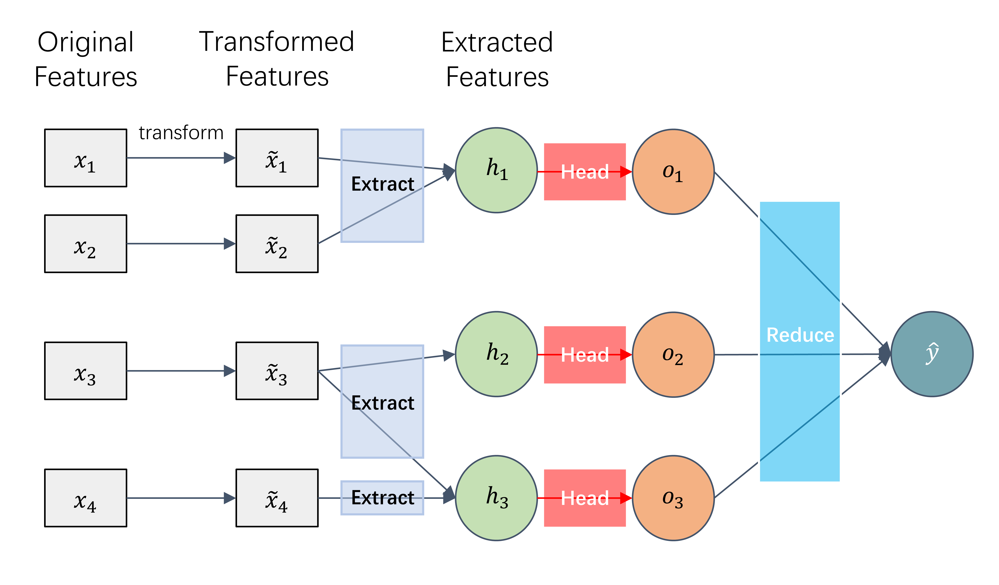

import Tabs from '@theme/Tabs';
import TabItem from '@theme/TabItem';

`carefree-learn` was designed to support most commonly used methods with 'carefree' APIs. Moreover, `carefree-learn` was also designed with interface which is general enough, so that more sophisticated functionality can also be easily integrated in the future. This brings a tension in how to create abstractions in code, which is a challenge for us:

+ On the one hand, it requires a reasonably high-level abstraction so that users can easily work around with it in a standard way, without having to worry too much about the details.
+ On the other hand, it also needs to have a very thin abstraction to allow users to do (many) other things in new ways. Breaking existing abstractions and replacing them with new ones should be fairly easy.

In `carefree-learn`, there are five main design principles that address this tension together:

+ Share configurations with the help of `Environment` (see [`Configurations`](getting-started/configurations#environment)).
+ Build some common blocks which shall be leveraged across different models (see [`Common Blocks`](#common-blocks)).
+ Divide `carefree-learn` into three parts: [`Model`](#model), [`Trainer`](#trainer) and [`Pipeline`](#pipeline), each focuses on certain roles.
+ Divide `Model` into three parts: [`transform`](#transform), [`extract`](#extract) and [`head`](#head), each focuses on one part of a [`pipe`](#pipe)
+ Implemente functions (`cflearn.register_*` to be exact) to ensure flexibility and control on different modules and stuffs (see [`Registration`](#registration)).

We will introduce the details in the following subsections.

## Common Blocks

> Source code: [blocks.py](https://github.com/carefree0910/carefree-learn/blob/dev/cflearn/modules/blocks.py).

Commonality is important for abstractions. When it comes to deep learning, it is not difficult to figure out the very common structure across all models: the `Mapping` Layers which is responsible for mapping data distrubution from one dimensional to another.

Although some efforts have been made to replace the `Mapping` Layers (e.g. DNDF[^1]), it is undeniable that the `Mapping` Layers should be extracted as a stand-alone module before any other structures. But in `carefree-learn`, we should do more than that.

Recall that `carefree-learn` focuses on tabular datasets, which means `carefree-learn` will use `Mapping` Layers in most cases (Unlike CNN or RNN which has Convolutional Blocks and RNNCell Blocks respectively). In this case, it is necessary to wrap multiple `Mapping`s into one single Module - also well known as `MLP` - in `carefree-learn`. So, in CNN we have `Conv2D`, in RNN we have `LSTM`, and in `carefree-learn` we have `MLP`.

## Model

> Source code: [`ModelBase`](https://github.com/carefree0910/carefree-learn/blob/ecdae9702456910b5075d1972de66a4f64ea733a/cflearn/models/base.py#L87).

In `carefree-learn`, a `Model` should implement the core algorithms.

+ It assumes that the input data in training process is already 'batched, processed, nice and clean', but not yet 'encoded'.
    + Fortunately, `carefree-learn` pre-defined some useful methods which can encode categorical columns easily and **EFFICIENTLY** (see [`Optimizations`](optimizations) for more details)
+ It does not care about how to train a model, it only focuses on how to make predictions with input, and how to calculate losses with them.

:::note
`Model` is likely to define `MLP` blocks frequently, as explained in the [Common Blocks](#common-blocks) section.
:::

One thing we would like to proudly announce is that `carefree-learn` has made an elegant abstraction, namely `pipe`, which is suitable for most of the models which aim at solving tabular tasks:

### `pipe`

Unlike unstructured datasets (CV, NLP, etc), it's hard to inject our prior knowledge into structured datasets because in most cases we simply use `MLP` to solve the problem. Researchers therefore mainly focused on how the improve the 'inputs' and the 'connections' of the traditional fully-connected ones. Some famous models, such as Wide-and-Deep[^2], Deep-and-Cross[^3], DeepFM[^4], share this common pattern. `carefree-learn` therefore defined `pipe`, which corresponds to one of those 'branches' which takes in all / part of the inputs, apply some `transform`s, `extract` some features, and then feed the final network (`head`) with these features. Here's an example:



In this model, we have $3$ `pipe`s. The first `pipe` takes in $x_1, x_2$, the second one takes in $x_3$, and the third one takes in $x_3, x_4$. After each `head` finishes its own calculation, we'll go through a `reduce` operation (which is often a `sum`) to get the final outputs.

Here are some examples of how to represent different structures with `pipe`:

:::note
We'll use some concepts of [transform](#transform), [extract](#extract) and [head](#head) below. If you're intrested in some of the details, feel free to navigate to the corresponding section😉
:::

:::tip
If you are interested in how to implement these models in `carefree-learn`, you can jump to the [Examples](#examples) section first, and you might be amazed by how simple and clear it could be😆
:::

<Tabs
  groupId="models"
  defaultValue="linear"
  values={[
    {label: 'Linear', value: 'linear'},
    {label: 'FCNN', value: 'fcnn'},
    {label: 'Wide & Deep', value: 'wnd'},
    {label: 'RNN', value: 'rnn'},
    {label: 'Transformer', value: 'transformer'},
  ]
}>
<TabItem value="linear">

A `Linear` model represents a `LinearRegression` (regression tasks) or a `LogisticRegression` / `SoftmaxRegression` (classification tasks), so its representation is fairly easy because it only needs 1 `pipe`:

:::note pipe Linear
1. `transform` would be a `default` transform.
2. `extract` would be an `identity` extract.
3. `head` would be an `Linear` head.
:::

</TabItem>
<TabItem value="fcnn">

An `FCNN` model is simply a **F**ully **C**onnected **N**eural **N**etwork, and almost the same as `Linear` except its `head` switches to `MLP`:

:::note pipe FCNN
1. `transform` would be a `default` transform.
2. `extract` would be an `identity` extract.
3. `head` would be an `MLP` head.
:::

</TabItem>
<TabItem value="wnd">

A `Wide & Deep` model generally splits the inputs into two parts, then feed them to a *wide* model and a *deep* model respectively. Concretely, a *wide* model takes in categorical features with `one_hot` encoding, while a *deep* model takes in numerical features and categorical features with `embedding` encoding. Its representation will be a little more complicated because it requires 2 `pipe`s:

:::note pipe wide
1. `transform` would be a `one_hot_only` transform.
2. `extract` would be an `identity` extract.
3. `head` would be an `Linear` head.
:::

:::note pipe deep
1. `transform` would be a `embedding` transform.
2. `extract` would be an `identity` extract.
3. `head` would be an `MLP` head.
:::

</TabItem>
<TabItem value="rnn">

An `RNN` model represents general **R**ecurrent **N**eural **N**etwork which is suitable for time series tasks. It differs from `FCNN` because it needs to extract the temporal information from the input data, so it should define a special `extract`, instead of using an `identity` one:

:::note pipe RNN
1. `transform` would be a `default` transform.
2. `extract` would be an `rnn` extract.
3. `head` would be an `MLP` head.
:::

</TabItem>
<TabItem value="transformer">

A `Transformer` model represents the encoder part of the Transformer model which has been used broadly in NLP tasks. Its representation looks familiar with `RNN`'s, except `Transformer` defines an `extract` with self attention mechanism:

:::note pipe Transformer
1. `transform` would be a `default` transform.
2. `extract` would be an `transformer` extract.
3. `head` would be an `MLP` head.
:::

</TabItem>
</Tabs>

### `transform`

In `carefree-learn`, a `transform` refers to 'encodings' that handle categorical features. Although there are plenty of encoding methods, we decide to stick to `one_hot` encoding and `embedding` encoding only because their performances are already promising enough. Besides, flexibility often means reductions in performance, so sticking to `one_hot` & `embedding` means we can perform better optimizations on them (see [`Optimizations`](optimizations) for more details).

In this case, `carefree-learn` pre-defined 7 types of `transform`, namely:
+ `default`: use numerical features, `one_hot` & `embedding`.
+ `one_hot`: use numerical features & `one_hot`.
+ `embedding`: use numerical features & `embedding`.
+ `one_hot_only`: use `one_hot` only.
+ `embedding_only`: use `embedding` only.
+ `categorical_only`: use `one_hot` & `embedding`.
+ `numerical`: use numerical features only.

### `extract`

In most cases `extract` would simply be `identity` because we can hardly treat tabular datasets as vision datasets or natrual language datasets, since the latter ones often contain prior knowledges. However, there're one case where we often need such step, and that's when we need to resolve a time series task. In such cases, the `rnn` extract / `transformer` extract often outshines the `identity` extract.

### `head`

The terminology `head` actually borrows from CV models where they call the last part of their model a `head`. We're feeling comfortable with this term because the last part of CV models are often `Linear` or `MLP`, which exactly matches our use cases.

### Examples

In this section we'll show how `carefree-learn` implements models under the `pipe` design:

<Tabs
  groupId="models"
  defaultValue="linear"
  values={[
    {label: 'Linear', value: 'linear'},
    {label: 'FCNN', value: 'fcnn'},
    {label: 'Wide & Deep', value: 'wnd'},
    {label: 'RNN', value: 'rnn'},
    {label: 'Transformer', value: 'transformer'},
  ]
}>
<TabItem value="linear">

```python
@ModelBase.register_pipe("linear")
class LinearModel(ModelBase):
    pass
```

</TabItem>
<TabItem value="fcnn">

```python
@ModelBase.register_pipe("fcnn")
class FCNN(ModelBase):
    pass
```

</TabItem>
<TabItem value="wnd">

```python
@ModelBase.register_pipe("fcnn", transform="embedding")
@ModelBase.register_pipe("linear", transform="one_hot_only")
class WideAndDeep(ModelBase):
    pass
```

</TabItem>
<TabItem value="rnn">

```python
@ModelBase.register_pipe("rnn", head="fcnn")
class RNN(ModelBase):
    pass
```

</TabItem>
<TabItem value="transformer">

```python
@ModelBase.register_pipe("transformer", head="fcnn")
class Transformer(ModelBase):
    pass
```

</TabItem>
</Tabs>

...That's right, simply register your `transform`, `extract` and `head`, then `carefree-learn` will handle the rest for you🥳

:::note
For detailed development guides, please refer to [Build Your Own Models](developer-guides/build-your-own-models).
:::


## Trainer

> Source code: [`Trainer`](https://github.com/carefree0910/carefree-learn/blob/3fb03dbfc3e2b494f2ab03b9d8f07683fe30e7ef/cflearn/trainer.py#L451).

In `carefree-learn`, a `Trainer` should implement the training parts, as listed below:

+ It assumes that the input data is already 'processed, nice and clean', but it should take care of getting input data into batches, because in real applications batching is essential for performance.
+ It should take care of the training loop, which includes updating parameters with an optimizer, verbosing metrics, checkpointing, early stopping, logging, etc.

## Pipeline

> Source code: [`Pipeline`](https://github.com/carefree0910/carefree-learn/blob/3fb03dbfc3e2b494f2ab03b9d8f07683fe30e7ef/cflearn/pipeline.py#L33).

In `carefree-learn`, a `Pipeline` should implement the high-level parts.

+ It should not make any assumptions to the input data, it could already be 'nice and clean', but it could also be 'dirty and messy'. Therefore, it needs to transform the original data into 'nice and clean' data and then feed it to `Trainer`. The data transformations include (this part is mainly handled by [`carefree-data`](https://github.com/carefree0910/carefree-data), though):
    + Imputation of missing values.
    + Transforming string columns into categorical columns.
    + Processing numerical columns.
    + Processing label column (if needed).
+ It should implement some algorithm-agnostic functions (e.g. `predict`, `save`, `load`, etc.).

## Registration

Registration in `carefree-learn` means registering user-defined modules to `carefree-learn`, so `carefree-learn` can leverage these modules to resolve more specific tasks. In most cases, the registration stuffs are done by simply defining and updating many global `dict`s.

For example, `carefree-learn` defined some useful parameter initializations in `cflearn.misc.toolkit.Initializer`. If we want to use our own initialization methods, simply register it and then everything will be fine:

```python
import torch
import cflearn

from torch.nn import Parameter

@cflearn.register_initializer("all_one")
def all_one(initializer_, parameter):
    parameter.fill_(1.)

param = Parameter(torch.zeros(3))
with torch.no_grad():
    cflearn.Initializer().initialize(param, "all_one")
print(param)  # tensor([1., 1., 1.], requires_grad=True)
```

:::info
Currently we mainly have 5 registrations in use: `register_metric`, `register_optimizer`, `register_scheduler`, `register_initializer` and `register_processor`
:::


[^1]: Kontschieder P, Fiterau M, Criminisi A, et al. Deep neural decision forests[C]//Proceedings of the IEEE international conference on computer vision. 2015: 1467-1475. 
[^2]: Cheng H T, Koc L, Harmsen J, et al. Wide & deep learning for recommender systems[C]//Proceedings of the 1st workshop on deep learning for recommender systems. 2016: 7-10. 
[^3]: Wang, Ruoxi, et al. “Deep & cross network for ad click predictions.” Proceedings of the ADKDD’17. 2017. 1-7. 
[^4]: Guo, Huifeng, et al. “Deepfm: An end-to-end wide & deep learning framework for CTR prediction.” 
