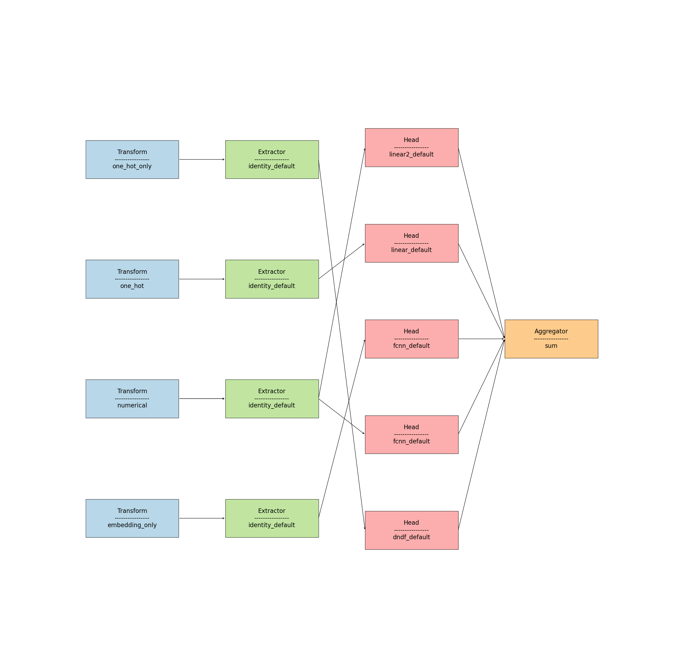
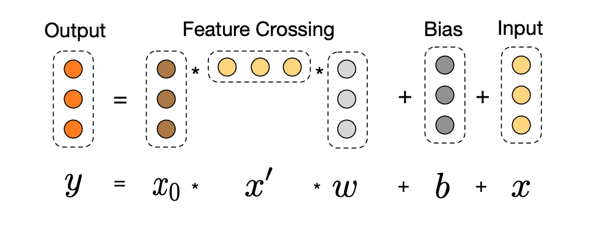

import Tabs from '@theme/Tabs';
import TabItem from '@theme/TabItem';

In this page we will go through some basic concepts we need to know to build our own models in `carefree-learn`. Customizing `carefree-learn` could be very easy if you only want to construct existing modules to form a new model structure, and should also be fairly straight forward even if you want to implement your own modules.

:::tip
There's a step-by-step example [here](../user-guides/examples#operations) which will walk you through the most important concepts with sufficient codes and experiments.
:::

:::note
In order to better understand the following contents, it is recommended to first understand the basic concepts mentioned in the [Design Principles](../design-principles#model).
:::


## `Configs`

Before we dive into the details of customization, we should first understand how `carefree-learn` manages its `Configs`. It is actually not more than an ordinary Python `dict`, except it can be *registered* in a certain *hierarchy* format. Basically, a `Configs` need to define a `scope` and a `name` for users to access it, where

+ A `scope` represents a `module`. 
+ A `name` represents the different `version` of the corresponding configuration.

For example, if we want to configure a `module` named `Foo` with different `dummy_value`:

```python
class Foo:
    def __init__(self, dummy_value: float):
        self.dummy = dummy_value
    
    def print(self) -> None:
        print(self.dummy)
```

Then we can leverage `cflearn.register_config` to register different configurations:

```python
import cflearn

cflearn.register_config("foo", "one", config={"dummy_value": 1.0})
cflearn.register_config("foo", "two", config={"dummy_value": 2.0})
```

:::info
Notice that we've implemented `get_default` for each class, which is the only necessary method we need to inherit from `Configs`.
:::

After registration, we can access them through their names, which is very convenient in many use cases (e.g. hyper parameter optimization):

```python
for name in ["one", "two"]:
    cfg = cflearn.Configs.get("foo", name)
    config = cfg.pop()
    Foo(**config).print()

# 1.0
# 2.0
```

:::info
Notice that we used `Configs.pop` to generate a Python `dict` for further usages.
:::

What's going on under the hood is that `carefree-learn` maintains a global `configs_dict` with following hierarchy:

```python
{
    "scope_0": {
        "name_00": config_class_00,
        "name_01": config_class_01,
    },
    "scope_1": {
        "name_10": config_class_10,
        "name_11": config_class_11,
    },
    ...,
    "scope_k": {
        "name_k0": config_class_k0,
        "name_k1": config_class_k1,
    },
}
```

So after the registration mentioned above, this global `configs_dict` will be updated to:

```python
{
    ...,
    "foo": {
        "one": FooOneConfig,
        "two": FooTwoConfig,
    }
}
```

### `HeadConfigs`

A `HeadConfigs` inherits from `Configs` and holds more information. The reason why we implement an extra sub-class of `Configs` is that we usually need more information in `head` than in `transform` and `extractor`. For instance, we need to know the data dimensions to inference the default `output_dim`.

:::note
We need to call `cflearn.register_head_config` if we want to register a new `HeadConfigs`.
:::

### Meta Configs

In some corner cases, we might need to
+ Depend one config to another.
+ Construct multiple configs simultaneously.

where `Meta Configs` will come to rescue. In `carefree-learn`, we leveraged `Meta Configs` to implement the `Neural Naive Bayes` model as shown [here](https://github.com/carefree0910/carefree-learn/blob/78d4b2f9f657139dabc5260decf6f73be30d5dd7/cflearn/models/nnb.py#L19-L29).

:::note
Similar to `metaclass` in Python, `Meta Configs` here is some kind of *black magic* and prones to be buggy. It is not recommended to be used unless we have to.
:::

Constructing `Meta Configs` itself has no differences with constructing normal configs, and the magic part comes to where you utilize it. For example, if we need to spend lots of time to train a model before we generate two configs that need different properties of this model:

```python
model = train()  # this will cost lots of time
config1 = {"foo": model.foo}
config2 = {"bar": model.bar}
```

We surely don't want to train the model over and over again when we are construting the configs, and that's exactly where `Meta Configs` can help us. Instead of:

```python
@cflearn.register_config("config1")
class Config1(cflearn.Configs):
    def get_default(self):
        model = train()
        return {"foo": model.foo}

@cflearn.register_config("config2")
class Config2(cflearn.Configs):
    def get_default(self):
        model = train()
        return {"bar": model.bar}
```

`Meta Configs` constructs configs as follows:

```python
@cflearn.register_config("meta_config")
class MetaConfig(cflearn.Configs):
    def get_default(self):
        model = train()
        return {
            "config1": {"foo": model.foo},
            "config2": {"bar": model.bar},
        }
```

In this way, we can prevent from calling `train()` twice.

### Example

In this section, we'll show you how to utilize `Meta Configs` with a runnable example. This example does not have any practical value, but can well illustrate the concepts mentioned above.

:::note
+ For examples on how to customize [HeadConfigs](#headconfigs), please refer to the [Customize `head`](#customize-head) section.
+ For details of `register_extractor` and `register_model`, please refer to [Customize `extractor`](#customize-extractor) and [`register_model`](#register_model) respectively.
:::

```python
import cflearn
import numpy as np
from sklearn.svm import SVR
from cflearn.modules.extractors import Identity

x = np.random.random([10 ** 4, 3])
y = np.random.random([10 ** 4, 1])

@cflearn.register_config("svr_meta", "default")
class SVRMetaConfig(cflearn.Configs):
    def get_default(self):
        svr = SVR().fit(x, y.ravel())
        return {
            "support": {"data": ("support", svr.support_)},
            "intercept": {"data": ("intercept", svr.intercept_)},
        }


@cflearn.register_extractor("support")
class Support(Identity):
    def __init__(self, in_flat_dim, dimensions, **kwargs):
        # kwargs == svr_meta["support"]
        super().__init__(in_flat_dim, dimensions, **kwargs)
        # so kwargs["data"] == ("support", svr.support_)
        print(kwargs["data"])


@cflearn.register_extractor("intercept")
class Intercept(Identity):
    def __init__(self, in_flat_dim, dimensions, **kwargs):
        # kwargs == svr_meta["intercept"]
        super().__init__(in_flat_dim, dimensions, **kwargs)
        # so kwargs["data"] == ("intercept", svr.intercept_)
        print(kwargs["data"])


cflearn.register_model(
    "test_svr",
    pipes=[
        cflearn.PipeInfo("support", extractor_meta_scope="svr_meta", head="linear"),
        cflearn.PipeInfo("intercept", extractor_meta_scope="svr_meta", head="linear"),
    ]
)

cflearn.make("test_svr").fit(x, y)
```

Which yields

```text
('support', array([   0,    1,    2, ..., 9996, 9997, 9998]))
('intercept', array([0.45095548]))
```


## Constructing Existing Modules

With the help of `Configs`, constructing existing modules is pretty easy because we can access different configurations by specifying their `scope` and `name`. In fact, as mentioned in [`Design Principles`](../design-principles#examples), `carefree-learn` itself is actually implementing its models by such similar process:

<Tabs
  groupId="models"
  defaultValue="linear"
  values={[
    {label: 'Linear', value: 'linear'},
    {label: 'FCNN', value: 'fcnn'},
    {label: 'Wide & Deep', value: 'wnd'},
    {label: 'RNN', value: 'rnn'},
    {label: 'Transformer', value: 'transformer'},
  ]
}>
<TabItem value="linear">

```python
@ModelBase.register("linear")
@ModelBase.register_pipe("linear")
class LinearModel(ModelBase):
    pass
```

</TabItem>
<TabItem value="fcnn">

```python
@ModelBase.register("fcnn")
@ModelBase.register_pipe("fcnn")
class FCNN(ModelBase):
    pass
```

</TabItem>
<TabItem value="wnd">

```python
@ModelBase.register("wnd")
@ModelBase.register_pipe("fcnn", transform="embedding")
@ModelBase.register_pipe("linear", transform="one_hot_only")
class WideAndDeep(ModelBase):
    pass
```

</TabItem>
<TabItem value="rnn">

```python
@ModelBase.register("rnn")
@ModelBase.register_pipe("rnn", head="fcnn")
class RNN(ModelBase):
    pass
```

</TabItem>
<TabItem value="transformer">

```python
@ModelBase.register("transformer")
@ModelBase.register_pipe("transformer", head="fcnn")
class Transformer(ModelBase):
    pass
```

</TabItem>
</Tabs>

### `register_model`

In `carefree-learn` we implemented an alias for `ModelBase.register`, which is often utilized together with [`register_pipe`](#register_pipe):

```python
def register_model(
    name: str,
    *,
    pipes: Optional[List[PipeInfo]] = None,
) -> Optional[Callable[[Type], Type]]:
    if pipes is None:
        return ModelBase.register(name)

    @ModelBase.register(name)
    class _(ModelBase):
        pass

    for pipe in pipes:
        _ = register_pipe(
            pipe.key,
            transform=pipe.transform,
            extractor=pipe.extractor,
            head=pipe.head,
            extractor_config=pipe.extractor_config,
            head_config=pipe.head_config,
            extractor_meta_scope=pipe.extractor_meta_scope,
            head_meta_scope=pipe.head_meta_scope,
        )(_)

    return None
```

It can be used to register a new model and access it through its name, which is very convenient in many use cases (e.g. hyper parameter optimization).

It's worth mentioning that this API could be utilized either in the OOP form:

```python
import cflearn

@cflearn.register_model("my_own_linear")
@cflearn.register_pipe("linear")
class MyOwnLinear(cflearn.ModelBase):
    pass
```

or in the functional form:

```python
import cflearn

cflearn.register_model("my_own_linear", pipes=[cflearn.PipeInfo("linear")])
```

:::info
In most cases the functional form is enough and easier to use, but the OOP form provides more flexibilities and can satisfy special needs.
:::

### `register_pipe`

In `carefree-learn` we implemented an alias for `ModelBase.register_pipe`, which is often utilized together with [`register_model`](#register_model):

```python
def register_pipe(
    key: str,
    *,
    transform: str = "default",
    extractor: Optional[str] = None,
    head: Optional[str] = None,
    extractor_config: str = "default",
    head_config: str = "default",
    extractor_meta_scope: Optional[str] = None,
    head_meta_scope: Optional[str] = None,
) -> Callable[[Type], Type]:
    return ModelBase.register_pipe(
        key,
        transform=transform,
        extractor=extractor,
        head=head,
        extractor_config=extractor_config,
        head_config=head_config,
        extractor_meta_scope=extractor_meta_scope,
        head_meta_scope=head_meta_scope,
    )
```

In this definition, the `extractor` and `head` arguments represent the corresponding `scope`, while `transform`, `extractor_config` and `head_config` represent the corresponding `name`. In other words, this definition actually means:

```python
transform_cfg = cflearn.Configs.get("transform", transform)
extractor_cfg = cflearn.Configs.get(extractor, extractor_config)
head_cfg = cflearn.HeadConfigs.get(head, head_config)
```

:::info
There is only one `scope` for `transform` because the number of choices of `transform` is limited (see [transform](../design-principles#transform) for more details).
:::

You may have noticed that there exists an `extractor_meta_scope` kwarg and a `head_meta_scope` kwarg, and they are where the [`Meta Configs`](#meta-configs) mechanism takes place.

:::note
Please refer to this [Example](#example) for more details.
:::

Besides these, there still remains a `key` argument in `register_pipe`, and this is where many default logics hide under the hood:

```python
if head is None:
    head = key
elif extractor is None:
    extractor = key
if extractor is None:
    extractor = "identity"
```

These logics simplify the definitions of some common structures, so in `carefree-learn` we only need to care about the `key` argument in most cases.

:::tip
For the `key` itself, the only constraint is that different [pipe](../design-principles#pipe) should correspond to different `key`.
:::

### Example

In this section, we will demonstrate how could we build a new model with following properties:

+ Use one hot features to train a `DNDF` `head`.
+ Use one hot features and numerical features to train a `linear` `head`.
+ Use numerical features to train a `linear` `head`.
+ Use numerical features to train an `fcnn` `head`.
+ Use embedding features to train an `fcnn` `head`.

```python
import cflearn

cflearn.register_model(
    "brand_new_model",
    pipes=[
        cflearn.PipeInfo("dndf", transform="one_hot_only"),
        cflearn.PipeInfo("linear", transform="one_hot"),
        cflearn.PipeInfo("linear2", transform="numerical", extractor="identity", head="linear"),
        cflearn.PipeInfo("fcnn", transform="numerical"),
        cflearn.PipeInfo("fcnn2", transform="embedding_only", extractor="identity", head="fcnn"),
    ]
)
```

We can actually visualize it with [`draw`](../getting-started/quick-start#visualizing) API (click to zoom in):

[  ](../../static/img/pipes/brand_new_model.png)

And can also play with it:

```python
import numpy as np

numerical = np.random.random([10000, 5])
categorical = np.random.randint(0, 10, [10000, 5])
x = np.hstack([numerical, categorical])
y = np.random.random([10000, 1])
m = cflearn.make("brand_new_model").fit(x, y)
print(m.model)
```

<details><summary><b>Which yields</b></summary>
<p>

```text
_(
  (pipes): Pipes(
    (dndf): one_hot_only_identity_default -> dndf_default
    (linear): one_hot_identity_default -> linear_default
    (linear2): numerical_identity_default -> linear_default
    (fcnn): numerical_identity_default -> fcnn_default
    (fcnn2): embedding_only_identity_default -> fcnn_default
  )
  (loss): MAELoss()
  (encoder): Encoder(
    (embeddings): ModuleList(
      (0): Embedding(
        (core): Lambda(embedding: 50 -> 4)
      )
    )
    (one_hot_encoders): ModuleList(
      (0): OneHot(
        (core): Lambda(one_hot_10)
      )
      (1): OneHot(
        (core): Lambda(one_hot_10)
      )
      (2): OneHot(
        (core): Lambda(one_hot_10)
      )
      (3): OneHot(
        (core): Lambda(one_hot_10)
      )
      (4): OneHot(
        (core): Lambda(one_hot_10)
      )
    )
    (embedding_dropout): Dropout(keep=0.8)
  )
  (transforms): ModuleDict(
    (one_hot_only): Transform(
      (use_one_hot): True
      (use_embedding): False
      (only_categorical): True
    )
    (one_hot): Transform(
      (use_one_hot): True
      (use_embedding): False
      (only_categorical): False
    )
    (numerical): Transform(
      (use_one_hot): False
      (use_embedding): False
      (only_categorical): False
    )
    (embedding_only): Transform(
      (use_one_hot): False
      (use_embedding): True
      (only_categorical): True
    )
  )
  (extractors): ModuleDict(
    (one_hot_only_identity_default): Identity()
    (one_hot_identity_default): Identity()
    (numerical_identity_default): Identity()
    (embedding_only_identity_default): Identity()
  )
  (heads): ModuleDict(
    (dndf): DNDFHead(
      (dndf): DNDF(
        (tree_proj): Linear(
          (linear): Linear(in_features=50, out_features=310, bias=True)
          (pruner): Pruner(method='auto_prune')
        )
      )
    )
    (linear): LinearHead(
      (linear): Linear(
        (linear): Linear(in_features=55, out_features=1, bias=True)
      )
    )
    (linear2): LinearHead(
      (linear): Linear(
        (linear): Linear(in_features=5, out_features=1, bias=True)
      )
    )
    (fcnn): FCNNHead(
      (mlp): MLP(
        (mappings): ModuleList(
          (0): Mapping(
            (linear): Linear(
              (linear): Linear(in_features=5, out_features=64, bias=False)
            )
            (bn): BN(64, eps=1e-05, momentum=0.1, affine=True, track_running_stats=True)
            (activation): ReLU(inplace=True)
            (dropout): Dropout(keep=0.5)
          )
          (1): Mapping(
            (linear): Linear(
              (linear): Linear(in_features=64, out_features=64, bias=False)
            )
            (bn): BN(64, eps=1e-05, momentum=0.1, affine=True, track_running_stats=True)
            (activation): ReLU(inplace=True)
            (dropout): Dropout(keep=0.5)
          )
          (2): Linear(
            (linear): Linear(in_features=64, out_features=1, bias=True)
          )
        )
      )
    )
    (fcnn2): FCNNHead(
      (mlp): MLP(
        (mappings): ModuleList(
          (0): Mapping(
            (linear): Linear(
              (linear): Linear(in_features=20, out_features=64, bias=False)
            )
            (bn): BN(64, eps=1e-05, momentum=0.1, affine=True, track_running_stats=True)
            (activation): ReLU(inplace=True)
            (dropout): Dropout(keep=0.5)
          )
          (1): Mapping(
            (linear): Linear(
              (linear): Linear(in_features=64, out_features=64, bias=False)
            )
            (bn): BN(64, eps=1e-05, momentum=0.1, affine=True, track_running_stats=True)
            (activation): ReLU(inplace=True)
            (dropout): Dropout(keep=0.5)
          )
          (2): Linear(
            (linear): Linear(in_features=64, out_features=1, bias=True)
          )
        )
      )
    )
  )
)
```

</p>
</details>


## Customizing New Modules

In this section, we'll introduce how to customize your own [`extractor`](../design-principles#extractor) and [`head`](../design-principles#head).

:::note
Currently `transform` is not customizable because `carefree-learn` sticks to `one_hot` and `embedding`. Please refer to [Design Principles](../design-principles#transform) for more details.
:::

:::tip
Again, we recommend [this](../user-guides/examples#operations) step-by-step example which will walk you through the most important concepts with sufficient codes and experiments.
:::

### Customize `extractor`

Recap that an [`extractor`](../design-principles#extractor) is responsible for extracting the (transformed) input data into latent features. For tabular datasets, it will simply be `identity` in most cases because we can hardly have any prior knowledge.

We can, however, inject prior knowledge into `carefree-learn` if we happen to have one. For example, if we have two features, namely *working hours* ($t$) and *wage* ($x$), and the target is to calculate the *actual income* ($y$):

$$
y=t\times x
$$

Although this task seems easy to humans, it is actually quite difficult for Neural Networks because Neural Networks lack information of multiplication across features. We can run a small experiment to quickly demonstrate this:

:::note
The example showing below is a simplified version of [Operations](../user-guides/examples#operations).
:::

```python
import cflearn
import numpy as np

x = np.random.random([10000, 2]) * 2.0
y = np.prod(x, axis=1, keepdims=True)

# `reg` represents a regression task
# `use_simplify_data` indicates that `carefree-learn` will do nothing to the input data
kwargs = {"task_type": "reg", "use_simplify_data": True}
fcnn = cflearn.make(**kwargs).fit(x, y)
cflearn.evaluate(x, y, pipelines=fcnn)
```

:::tip
We've set `use_simplify_data` to `True`. That's because we want to hold the datasets' property, so we should not apply any pre-processing strategies to the original dataset.
:::

Which yields

```text
================================================================================================================================
|        metrics         |                       mae                        |                       mse                        |
--------------------------------------------------------------------------------------------------------------------------------
|                        |      mean      |      std       |     score      |      mean      |      std       |     score      |
--------------------------------------------------------------------------------------------------------------------------------
|          fcnn          |    0.062123    |    0.000000    |    -0.06212    |    0.006766    |    0.000000    |    -0.00676    |
================================================================================================================================
```

We can see that `fcnn` failed to approach to the ground truth. In order to improve this, we can implement an `extractor` to generate a new feature representing cross-feature multiplication (with the help of `cflearn.register_extractor`):

```python
import torch

# The name `cross_multiplication` is actually the `scope` of this `extractor`
@cflearn.register_extractor("cross_multiplication")
class CrossMultiplication(cflearn.ExtractorBase):
    # This property represents the dimension of this `extractor`'s output
    @property
    def out_dim(self) -> int:
        return 1

    # This is where your algorithms should be implemented
    # net.shape : [ batch_size, in_dim ]
    def forward(self, net: torch.Tensor) -> torch.Tensor:
        prod = net[..., 0] * net[..., 1]
        return prod.view([-1, 1])
```

After defining the `extractor`, we need to (at least) define the `default` config under its `scope`:

```python
cflearn.register_config("cross_multiplication", "default", config={})
```

Since `CrossMultiplication` doesn't really need any configurations, simply returning an empty Python `dict` will be enough.

With these two steps, we have already implemented a ready-to-use `extractor` which holds our prior knowledge, so the next step is to utilize it:

```python
cflearn.register_model(
    "multiplication",
    pipes=[cflearn.PipeInfo("linear", extractor="cross_multiplication")]
)
```

And that's it! Because `carefree-learn` will do most of the boiler plates for you.

Let's run a small experiment to demonstrate the validaty of our new model:

```python
mul = cflearn.make("multiplication", **kwargs).fit(x, y)
cflearn.evaluate(x, y, pipelines=[fcnn, mul])
```

Which yields

```text
================================================================================================================================
|        metrics         |                       mae                        |                       mse                        |
--------------------------------------------------------------------------------------------------------------------------------
|                        |      mean      |      std       |     score      |      mean      |      std       |     score      |
--------------------------------------------------------------------------------------------------------------------------------
|          fcnn          |    0.065125    | -- 0.000000 -- |    -0.06512    |    0.007785    | -- 0.000000 -- |    -0.00778    |
--------------------------------------------------------------------------------------------------------------------------------
|     multiplication     | -- 0.000078 -- | -- 0.000000 -- | -- -0.00007 -- | -- 0.000000 -- | -- 0.000000 -- | -- -0.00000 -- |
================================================================================================================================
```

As we expected, the `multiplication` model approaches to the ground truth🥳

### Customize `head`

Although the result is satisfying, in most real-life cases it is hard to obtain such strong prior knowledges. Recap that `fcnn` fails because it lacks cross-feature information, so a model with cross-feature information should be able to solve this *total income* task, and that's where Deep-and-Cross[^1] network comes to rescue:



Since `carefree-learn` has already implemented [`CrossBlock`](https://github.com/carefree0910/carefree-learn/blob/03edf2bd8cc32b7fe2ce30be6e4196adf7ab0bde/cflearn/modules/blocks.py#L508), we can utilize it to build our `CrossHead` easily (with the help of `cflearn.register_head`):

```python
from typing import Optional
from cflearn.modules.blocks import Linear
from cflearn.modules.blocks import CrossBlock
from cflearn.misc.toolkit import Activations

# The name `cross` is actually the `scope` of this `head`
@cflearn.register_head("cross")
class CrossHead(cflearn.HeadBase):
    def __init__(self, in_dim: int, out_dim: int, activation: Optional[str]):
        super().__init__(in_dim, out_dim)
        self.cross = CrossBlock(in_dim, residual=False, bias=False)
        if activation is None:
            self.activation = None
        else:
            self.activation = Activations.make(activation)
        self.linear = Linear(in_dim, out_dim)
    
    def forward(self, net: torch.Tensor) -> torch.Tensor:
        net = self.cross(net, net)
        if self.activation is not None:
            net = self.activation(net)
        return self.linear(net)
```

After defining the `head`, we need to (at least) define the `default` config under its `scope`:

```python
# Notice that we need to call `register_head_config` for registering `HeadConfigs`, as mentioned in the `HeadConfigs` section
# We need to define `activation` because `CrossHead` requires it
# However we don't need to define `in_dim` and `out_dim`, because `carefree-learn` will handle them for us!
cflearn.register_head_config("cross", "default", head_config={"activation": None})
```

With these two steps, we have already implemented a ready-to-use `head` which can perform cross-feature operations, so the next step is to utilize it:

```python
cflearn.register_model("cross", pipes=[cflearn.PipeInfo("cross")])
```

Again, that's it! Let's run a small experiment to demonstrate the validaty of our new model:

```python
cross = cflearn.make("cross", **kwargs).fit(x, y)
cflearn.evaluate(x, y, pipelines=[fcnn, mul, cross])
```

Which yields

```text
================================================================================================================================
|        metrics         |                       mae                        |                       mse                        |
--------------------------------------------------------------------------------------------------------------------------------
|                        |      mean      |      std       |     score      |      mean      |      std       |     score      |
--------------------------------------------------------------------------------------------------------------------------------
|         cross          |    0.000178    | -- 0.000000 -- |    -0.00017    |    0.000000    | -- 0.000000 -- |    -0.00000    |
--------------------------------------------------------------------------------------------------------------------------------
|          fcnn          |    0.064953    | -- 0.000000 -- |    -0.06495    |    0.007111    | -- 0.000000 -- |    -0.00711    |
--------------------------------------------------------------------------------------------------------------------------------
|     multiplication     | -- 0.000025 -- | -- 0.000000 -- | -- -0.00002 -- | -- 0.000000 -- | -- 0.000000 -- | -- -0.00000 -- |
================================================================================================================================
```

As we expected, the `cross` model approaches to the ground truth🥳

:::note
Notice that we've used `residual=False` in `CrossBlock`, which is the secret ingredient of why `cross` model can approach to the ground truth.
:::

### Conclusions

The above two sections showed us how to customize our own `extractor` and `head`, which should be sufficient to implement most of the models targeting tabular datasets. `carefree-learn` actually supports more customizations (e.g. metrics, initializations, etc), but they are more of some tricks than the main part of an algorithm. We hope that this guide can help you leverage `carefree-learn` in your own tasks!


## Customizing New Aggregators

In this section, we'll introduce how to customize your own [`Aggregator`](../design-principles#aggregator). Although we have already done many experiments across different datasets and finds out that a simple `sum` operation is quite enough for most cases, `carefree-learn` yet supports registering new aggregator for special needs (with the help of `cflearn.register_aggregator`).

In fact, if you have read over the previous section, you may notice that we can solve the *actual income* task with a custom [`Aggregator`](../design-principles#aggregator) - the `Prod` aggregator:

```python
import cflearn

@cflearn.register_aggregator("prod")
class Prod(cflearn.AggregatorBase):
    def reduce(self, outputs, **kwargs):
        return {"predictions": outputs["linear"] * outputs["linear2"]}

cflearn.register_model(
    "prod",
    pipes=[
        cflearn.PipeInfo("linear"),
        cflearn.PipeInfo("linear2", extractor="identity", head="linear")
    ]
)
```

Here, we've defined two [`pipe`](../design-principles#pipe) with `linear` head, then we aggregate them with a `multiply` operation to get our final output. Since the ground truth ($y=t\times x$) is as well a `multiply` operation between features, this design should be able to achieve great performance. We can run the experiment mentioned in previous section to demonstrate it:

```python
import numpy as np

x = np.random.random([10000, 2]) * 2.0
y = np.prod(x, axis=1, keepdims=True)

# `reg` represents a regression task
# `use_simplify_data` indicates that `carefree-learn` will do nothing to the input data
kwargs = {"task_type": "reg", "use_simplify_data": True}
prod = cflearn.make("prod", aggregator="prod", **kwargs).fit(x, y)
cflearn.evaluate(x, y, pipelines=prod)
```

Which yields

```text
================================================================================================================================
|        metrics         |                       mae                        |                       mse                        |
--------------------------------------------------------------------------------------------------------------------------------
|                        |      mean      |      std       |     score      |      mean      |      std       |     score      |
--------------------------------------------------------------------------------------------------------------------------------
|          prod          |    0.000345    |    0.000000    |    -0.00034    |    0.000000    |    0.000000    |    -0.00000    |
================================================================================================================================
```

As we expected, the `prod` model with `prod` aggregator approaches to the ground truth🥳


## Customizing New Losses

In this section, we'll introduce how to customize your own losses. Customizing new losses often means that you're facing a difficult task, and you're using your talent to solve it. So congratulations to you because you've reached here!

### Introduction

In `carefree-learn`, it is pretty straight forward to define new losses. For example, `carefree-learn` itself defines `MSELoss` as follows:

```python
@LossBase.register("mse")
class MSELoss(LossBase):
    def _core(
        self,
        forward_results: tensor_dict_type,
        target: torch.Tensor,
        **kwargs: Any,
    ) -> torch.Tensor:
        return F.mse_loss(forward_results["predictions"], target, reduction="none")
```

There are a few things that we need to clarify:
+ The minimal requirement is to implement the abstract `_core` method, as shown above. We need to make sure that this method returns the *raw* losses (notice that we've used `reduction="none"` in `F.mse_loss`), because `carefree-learn` requires the *raw* losses to further perform some post-processings.
+ We have `forward_results` as input, which is a `tensor_dict_type`. This is exactly what a [`Model`](../design-principles#model) will return to you. In most cases, this is simply `{"predictions": predictions}`. But in some special cases (e.g. the [`DDR`](https://github.com/carefree0910/carefree-learn/blob/c80365049c0cb9e5baf43c1a1e7cabcdc04610ed/cflearn/models/ddr/model.py#L20) model), the hierarchy may be more complicated than one single `"predictions"` key. For example, in quantile models ([`QuantileFCNN`](https://github.com/carefree0910/carefree-learn/blob/c80365049c0cb9e5baf43c1a1e7cabcdc04610ed/cflearn/models/fcnn.py#L18), [`DDR`](https://github.com/carefree0910/carefree-learn/blob/c80365049c0cb9e5baf43c1a1e7cabcdc04610ed/cflearn/models/ddr/model.py#L20)), we require developers to include a `"quantiles"` key in `forward_results`, so we can implement the `Quantile` loss as follows:

```python
@LossBase.register("quantile")
class Quantile(LossBase):
    def _init_config(self, config: Dict[str, Any]) -> None:
        self.q = ...

    def _core(
        self,
        forward_results: tensor_dict_type,
        target: torch.Tensor,
        **kwargs: Any,
    ) -> torch.Tensor:
        quantile_error = target - forward_results["quantiles"]
        neg_errors = self.q * quantile_error
        pos_errors = (self.q - 1) * quantile_error
        quantile_losses = torch.max(neg_errors, pos_errors)
        return quantile_losses.mean(1, keepdim=True)
```

So basically you only need to consider how to fetch one (or some) of the outputs from your model, compare it (or them) to the target, and finally get the (raw) losses.

### Example

In this section, we will provide an example to illustrate how to define a new loss function, which only cares about whether the outputs of the model is close to `1`.

```python
import cflearn

@cflearn.register_loss("to_one")
class ToOneLoss(cflearn.LossBase):
    def _core(self, forward_results, target, **kwargs):
        return (forward_results["predictions"] - 1.0).abs()
```

:::note
You might notice that `carefree-learn` has provided `cflearn.register_loss` API as an alias of `LossBase.register`.
:::

We can try this loss with a simple experiment:

```python
import numpy as np
from cflearn.misc.toolkit import to_numpy

x = np.random.random([1000, 4])
y = np.random.random([1000, 1])
# we need to use `loss` as metrics here
# because `mae` and `mse` are no longer valid metrics under the `to_one` loss
m = cflearn.make("linear", loss="to_one", metrics="loss").fit(x, y)
linear = m.model.heads["linear"].linear
print("w:", to_numpy(linear.weight.data))
print("b:", to_numpy(linear.bias.data))
```

Which yields

```text
w: [[-3.6413432e-05  3.4193643e-05 -1.0862313e-04  1.1812412e-04]]
b: [1.0000271]
```

This means that the `to_one` loss is actually working😆


[^1]: Wang, Ruoxi, et al. “Deep & cross network for ad click predictions.” Proceedings of the ADKDD’17. 2017. 1-7. 
