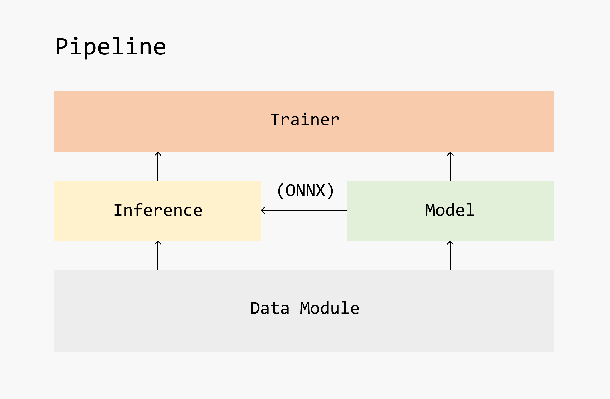

[  ](../static/img/framework.png)
*Framework of carefree-learn*


## Advantages

Like many similar projects, `carefree-learn` can be treated as a high-level library to help with training neural networks in PyTorch. However, `carefree-learn` does more than that.

+ `carefree-learn` once focused on tabular (structured) datasets (`v0.1.x`), and since `v0.2.x`, unstructured datasets (e.g. CV datasets or NLP datasets) are also supported with ❤️ as well!
  > And CV came before NLP because I'm more familiar with it 🤣.
+ `carefree-learn` is **highly customizable** for developers. We have already wrapped (almost) every single functionality / process into a single module (a Python class), and they can be replaced or enhanced either directly from source codes or from local codes with the help of some pre-defined functions provided by `carefree-learn` (see [Register Mechanism](/docs/design-principles#register-mechanism)).
+ `carefree-learn` supports easy-to-use saving and loading. By default, everything will be wrapped into a `.zip` file, and `onnx` format is natively supported!
+ `carefree-learn` supports Distributed Training.

Apart from these, `carefree-learn` also has quite a few specific advantages in each area:

### Machine Learning 📈

+ `carefree-learn` provides an end-to-end pipeline for tabular tasks, including **AUTOMATICALLY** deal with (this part is mainly handled by [`carefree-data`](https://github.com/carefree0910/carefree-data), though):
    + Detection of redundant feature columns which can be excluded (all SAME, all DIFFERENT, etc).
    + Detection of feature columns types (whether a feature column is string column / numerical column / categorical column).
    + Imputation of missing values.
    + Encoding of string columns and categorical columns (Embedding or One Hot Encoding).
    + Pre-processing of numerical columns (Normalize, Min Max, etc.).
    + And much more...
+ `carefree-learn` can help you deal with almost **ANY** kind of tabular datasets, no matter how *dirty* and *messy* it is. It can be either trained directly with some numpy arrays, or trained indirectly with some files locate on your machine. This makes `carefree-learn` stand out from similar projects.

:::info
From the discriptions above, you might notice that `carefree-learn` is more of a minimal **Automatic Machine Learning** (AutoML) solution than a pure Machine Learning package.
:::

:::tip
When we say **ANY**, it means that `carefree-learn` can even train on one single sample.

<details><summary><b>For example</b></summary>
<p>

```python
import cflearn

toy = cflearn.ml.make_toy_model()
data = toy.data.cf_data.converted
print(f"x={data.x}, y={data.y}")  # x=[[0.]], y=[[1.]]
```

</p>
</details>
<br />

This is especially useful when we need to do unittests or to verify whether our custom modules (e.g. custom pre-processes) are correctly integrated into `carefree-learn`.

<details><summary><b>For example</b></summary>
<p>

```python {19,22}
import cflearn
import numpy as np

# here we implement a custom processor
@cflearn.register_processor("plus_one")
class PlusOne(cflearn.Processor):
    @property
    def input_dim(self) -> int:
        return 1

    @property
    def output_dim(self) -> int:
        return 1

    def fit(self, columns: np.ndarray) -> cflearn.Processor:
        return self

    def _process(self, columns: np.ndarray) -> np.ndarray:
        return columns + 1

    def _recover(self, processed_columns: np.ndarray) -> np.ndarray:
        return processed_columns - 1

# we need to specify that we use the custom process method to process our labels
toy = cflearn.ml.make_toy_model(cf_data_config={"label_process_method": "plus_one"})
data = toy.data.cf_data
y = data.converted.y
processed_y = data.processed.y
print(f"y={y}, new_y={processed_y}")  # y=[[1.]], new_y=[[2.]]
```

</p>
</details>
:::

There is one more thing we'd like to mention: `carefree-learn` is *[Pandas](https://pandas.pydata.org/)-free*. The reasons why we excluded [Pandas](https://pandas.pydata.org/) are listed in [`carefree-data`](https://github.com/carefree0910/carefree-data).

### Computer Vision 🖼️

+ `carefree-learn` also provides an end-to-end pipeline for computer vision tasks, and:
    + Supports native `torchvision` datasets.

      ```python
      data = cflearn.cv.MNISTData(transform="to_tensor")
      ```
      > Currently only `mnist` is supported, but will add more in the future (if needed) !
    + Focuses on the `ImageFolderDataset` for customization, which:
        + Automatically splits the dataset into train & valid.
        + Supports generating labels in parallel, which is very useful when calculating labels is time consuming.
      
      See [**IFD** introduction](/docs/user-guides/computer-vision) for more details.
+ `carefree-learn` supports various kinds of `Callback`s, which can be used for saving intermediate visualizations / results.
    + For instance, `carefree-learn` implements an `ArtifactCallback`, which can dump artifacts to disk elaborately during training.


## Configurations

In most cases, [`Pipeline`](design-principles#pipeline) will be the (internal) user interface in `carefree-learn`, which can handle training, evaluating, saving and loading easily.
Therefore, configurations in `carefree-learn` is mostly done by sending args and kwargs to the [`Pipeline`](design-principles#pipeline) module.

In order to provide even better user experience, `carefree-learn` also provides many handy APIs to directly access to corresponding [`Pipeline`](design-principles#pipeline)s or [`Model`](design-principles#model)s. For example, if we want to use `resnet18` model, we can access it with one line of code:

```python
model = cflearn.api.resnet18_model(1000)
```

It's also possible to load pretrained-weights by specifying `pretrained=True`:

```python
model = cflearn.api.resnet18_model(1000, pretrained=True)
```

:::note
It is worth mentioning that although `carefree-learn` supports very fine-grained configurations (e.g. supports configuring different optimizers for different parameters, which is a common use case in GANs), it also provides straight forward configurations when the tasks are not so complicated.

<details><summary><b>For instance, in GAN tasks, we may need to</b></summary>
<p>

```python {5-12}
m = cflearn.cv.CarefreePipeline(
    "gan",
    {"img_size": 28, "in_channels": 1},
    optimizer_settings={
        "g_parameters": {
            "optimizer": "adam",
            "scheduler": "warmup",
        },
        "d_parameters": {
            "optimizer": "sgd",
            "scheduler": "plateau",
        },
    },
)
```

</p>
</details>
<br />

<details><summary><b>But in 'simple' tasks, we may only need to</b></summary>
<p>

```python {4-5}
m = cflearn.cv.CarefreePipeline(
    "gan",
    {"img_size": 28, "in_channels": 1},
    optimizer_name="adam",
    scheduler_name="warmup",
)
```

</p>
</details>
<br />

<details><summary><b>And if we simply want to run a default configuration, we can </b></summary>
<p>

```python
m = cflearn.api.vanilla_gan(28)
```

And the rest will be handled by `carefree-learn`:

```python
print(m.trainer.optimizer_packs)
"""
[OptimizerPack(scope='g_parameters', optimizer_name='adam', scheduler_name='warmup', optimizer_config=None, scheduler_config=None),
 OptimizerPack(scope='d_parameters', optimizer_name='adam', scheduler_name='warmup', optimizer_config=None, scheduler_config=None)]
"""
```

</p>
</details>

:::

:::info
Please refer to the [Configurations](getting-started/configurations) section for further details.
:::


## Components

As shown in the framework at the beginning of this page, `carefree-learn` is mainly constructed with 5 loose coupled modules:
+ `Data Layer`: this part is mainly handled by [`carefree-data`](https://github.com/carefree0910/carefree-data) & `DataLoader` (from `PyTorch`) for Machine Learning 📈 & Computer Vision 🖼️ tasks respectively.
+ [`Model`](design-principles#model): should implement the core algorithms (basically it should implement the `forward` method).
+ [`Inference`](https://github.com/carefree0910/carefree-learn/blob/3d2bf377ada0b5c8c85c79d5be13d723e64cb3dc/cflearn/protocol.py#L367): it is responsible for making inference. It should be able to work w/ or w/o a [`Model`](design-principles#model), where for the latter case it will use `ONNX` instead.
+ [`Trainer`](https://github.com/carefree0910/carefree-learn/blob/f5e3d92a4ad5a4e320397f66253804e43839fc41/cflearn/trainer.py#L352): it will train a [`Model`](design-principles#model) with specific training data loader & validation data loader.
+ [`Pipeline`](design-principles#pipeline): as mentioned above, it serves as the user interface in `carefree-learn`.

:::note
Please refer to [Design Principles](design-principles) for further details.
:::


## Data Loading Strategy

The data loading strategy of tabular datasets is very different from unstructured datasets' strategy. For instance, it is quite common that a CV dataset is a bunch of pictures located in a folder, and we will either read them sequentially or read them in parallel. Nowadays, almost every famous deep learning framework has their own solution to load unstructured datasets efficiently, e.g. PyTorch officially implements [DataLoader](https://pytorch.org/docs/stable/data.html#torch.utils.data.DataLoader) to support multi-process loading and other features (which is also adopted by `carefree-learn`).

Although we know that RAM speed is (almost) always faster than I/O operations, we still prefer leveraging multi-process to read files than loading them all into RAM at once. This is because unstructured datasets are often too large to allocate them all to RAM. However, when it comes to tabular datasets, we prefer to load everything into RAM at the very beginning. The main reasons are listed below:

+ Tabular datasets are often quite small and are able to put into RAM once and for all.
+ Network structures for tabular datasets are often much smaller, which means using multi-process loading will cause a much heavier overhead.
+ We need to take Distributed Training into account. If we stick to multi-process loading, there would be too many threads in the pool which is not a good practice.


## Terminologies

In `carefree-learn`, there are some frequently used terminologies, and we will introduce them in this section. If you are confused by some other terminologies in `carefree-learn` when you are using it, feel free to edit this list:

### step

One **`step`** in the training process means that one mini-batch passed through our model.

### epoch

In most deep learning processes, training is structured into epochs. An epoch is one iteration over the entire input data, which is constructed by several **`step`**s.

### batch_size

It is a good practice to slice the data into smaller batches and iterates over these batches during training, and **`batch_size`** specifies the size of each batch. Be aware that the last batch may be smaller if the total number of samples is not divisible by the **`batch_size`**.

### config

A **`config`** indicates the main part (or, the shared part) of the configuration.

### increment_config

An **`increment_config`** indicates the configurations that you want to update on **`config`**.

:::tip
This is very useful when you only want to tune a single configuration and yet you have tons of other configurations need to be fixed. In this case, you can set the shared configurations as **`config`**, and adjust the target configuration in **`increment_config`**.
:::

### forward

A **`forward`** method is a common method required by (almost) all PyTorch modules.

:::info
[Here](https://discuss.pytorch.org/t/about-the-nn-module-forward/20858) is a nice discussion.
:::

### task_type

We use `task_type = "clf"` to indicate a classification task, and `task_type = "reg"` to indicate a regression task.

:::info
And we'll convert them into [cfdata.tabular.TaskTypes](https://github.com/carefree0910/carefree-data/blob/82f158be82ced404a1f4ac37e7a669a50470b109/cfdata/tabular/misc.py#L126) under the hood.
:::

### train, valid & test

+ We use `train` dataset to **directly optimize** our model (please refer to [optimizers](#optimizers) for more details).
+ We use `valid` (validation) dataset to **monitor** our model, and to decide which checkpoint should we use / when shall we perform early strop.
+ We use `test` dataset to **evaluate** our model.

### metrics

Although `losses` are what we optimize directly during training, `metrics` are what we *actually* want to optimize (e.g. `acc`, `auc`, `f1-score`, etc.). Sometimes we may want to take multiple `metrics` into consideration, and we may also want to eliminate the fluctuation comes with mini-batch training by applying EMA on the metrics.

Of course, `carefree-learn` also supports using `losses` as `metrics` directly 😉.

:::tip
Please refer to [metrics](getting-started/configurations#metrics) and see how to customize the behaviour of `metrics` in `carefree-learn`.
:::

### optimizers

In PyTorch (and other deep learning framework) we have `optimizers` to *optimize* the parameters of our model. We sometimes need to divide the parameters into several groups and optimize them individually (which is quite common in GANs).

:::tip
Please refer to [optimizers](getting-started/configurations#optimizers) and see how to control the behaviour of `optimizers` in `carefree-learn`.
:::


[^1]: [**D**eep **N**eural **D**ecision **F**orests](https://www.cv-foundation.org/openaccess/content_iccv_2015/papers/Kontschieder_Deep_Neural_Decision_ICCV_2015_paper.pdf)

[^2]: [**D**eep **D**istribution **R**egression](https://arxiv.org/pdf/1911.05441.pdf)
