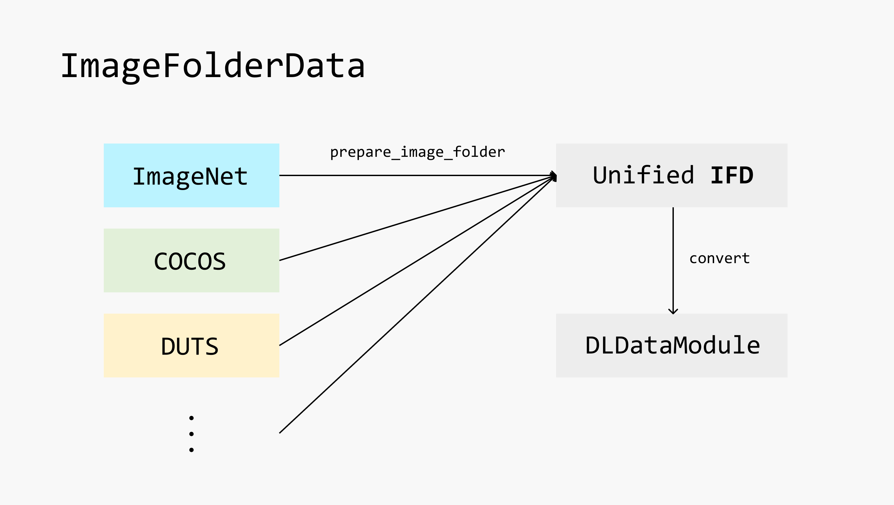

import Tabs from '@theme/Tabs';
import TabItem from '@theme/TabItem';

:::tip
+ For general introduction on how to use `carefree-learn`, please refer to the [General](general) section.
+ For development guide, please refer to the [Developer Guides](../developer-guides/computer-vision) section.
:::


## Introduction

In this section, we will introduce how to utilize `carefree-learn` to solve computer vision tasks.

What differs computer vision tasks to other deep learning tasks most is that, most of the dataset could be interpreted as '**Image Folder Dataset**' (abbr: **IFD**). In this case, the source images (which will be the input of our models) will be stored in certain folder structure, and the labels (which will be the target of our models) can be represented by the hierarchy of each image file.

Therefore, `carefree-learn` introduces [`ImageFolderData`](#imagefolderdata) as the unified data api for computer vision tasks. We will first introduce how different tasks could be represented as **IFD**, and will then introduce how to construct [`ImageFolderData`](#imagefolderdata) in the next section.

### Generation

Since generation tasks (usually) don't require labels, any image folder will be **IFD** itself.

### Classification

There are many ways to construct classification tasks as **IFD**:
+ Specify labels with the sub-folders' names.
+ Specify labels with a `.csv` file, in which each row contains a file name and its corresponding label.

<Tabs
  defaultValue="folder"
  values={[
    {label: 'Folder Name', value: 'folder'},
    {label: 'CSV File', value: 'csv'},
  ]
}>

<TabItem value="folder">

```text
|--- data
  |-- dog
    |-- 0.png
    |-- 1.png
    ...
  |-- cat
    |-- 0.png
    |-- 1.png
    ...
  ...
```

</TabItem>

<TabItem value="csv">

```text
|--- data
  |-- labels.csv
  |-- images
    |-- 0.png
    |-- 1.png
    ...
```

**labels.csv**

```csv
0.png,dog
1.png,cat
```

</TabItem>

</Tabs>

### Segmentation

The simplest way to construct segmentation tasks as **IFD** is to mimic the image folder structure and replace `.png` (image file) with `.npy` (mask file).

```text
|--- data
  |-- images
    |-- 0.png
    |-- 1.png
    ...
  |-- masks
    |-- 0.npy
    |-- 1.npy
```


## `ImageFolderData`

`carefree-learn` provides a convenient API (see [`prepare_image_folder_data`](#prepare_image_folder_data)) to construct `ImageFolderData`. But before we dive into details, it's necessary to know how `carefree-learn` organizes its **IFD** and how does it convert an **IFD** to the final `ImageFolderData`.

### Design Principles

Since every task may have its own image folder structure, it will be very difficult to design a unified API to cover all the situations. `carefree-learn` therefore designs its [own **IFD** pattern](#ifd-in-carefree-learn), and implements [`prepare_image_folder`](#prepare_image_folder) to convert other image folder structure to this pattern:

[  ](../../static/img/image-folder-data.png)

### Unified IFD

In `carefree-learn`, we will expect the unified **IFD** to be as follows:

```text
|--- data
  |-- train
    |-- xxx.png
    |-- xxx.png
    ...
    |-- labels.json
    |-- path_mapping.json
  |-- valid
    |-- xxx.png
    |-- xxx.png
    ...
    |-- labels.json
    |-- path_mapping.json
  |-- idx2labels.json
  |-- labels2idx.json
  ...
```

+ The `train` folder represents all data used in training.
    + We will call it the 'train split' in the future.
+ The `valid` folder represents all data used in valitation.
    + We will call it the 'valid split' in the future.
+ The `labels.json` in each split represents the label information:

    ```json
    {
        "/full/path/to/first.png": xxx,
        "/full/path/to/second.png": xxx,
        ...
    }
    ```

    The keys will be the absolute paths of the images, and the values will be the corresponding labels.
    + If the labels are strings and end with `.npy`, we will load the corresponding `np.ndarray`.
    + Other wise, the labels should be integers / floats and will be kept as-is.
+ The `path_mapping.json` in each split represents the path mapping:

    ```json
    {
        "/full/path/to/first.png": "relative/path/to/original/first.png",
        "/full/path/to/second.png": "relative/path/to/original/second.png",
    }
    ```

    This means that the **IFD** in `carefree-learn` should be a copy of the original **IFD**, because we want to keep an individual version of each **IFD**.
+ The `idx2labels.json` represents the mapping from indices to original labels.
    + This is useful iff we are solving classification tasks and the original labels are strings.
+ The `labels2idx.json` represents the mapping from original labels to indices.
    + This is useful iff we are solving classification tasks and the original labels are strings.

### `prepare_image_folder`

```python
def prepare_image_folder(
    src_folder: str,
    tgt_folder: str,
    *,
    to_index: bool,
    prefix: Optional[str] = None,
    preparation: _PreparationProtocol = DefaultPreparation(),
    force_rerun: bool = False,
    extensions: Optional[Set[str]] = None,
    make_labels_in_parallel: bool = False,
    num_jobs: int = 8,
    train_all_data: bool = False,
    valid_split: Union[int, float] = 0.1,
    max_num_valid: int = 10000,
    lmdb_config: Optional[Dict[str, Any]] = None,
    use_tqdm: bool = True,
) -> str:
```

+ **`src_folder`**
    + Path of the original **IFD**.
+ **`tgt_folder`**
    + Specify the path where we want to place our unified **IFD**.
+ **`to_index`**
    + Specify whether should we turn the original labels to indices.
    + This is useful iff we are solving classification tasks and the original labels are strings.
+ **`prefix`** [default = `None`]
    + Specify the prefix of `src_folder`.
    + Sometimes this is useful when we need to customize our own [`_PreparationProtocol`](#_preparationprotocol).
    + See [`hierarchy`](#hierarchy) section for more details.
+ **`preparation`** [default = `DefaultPreparation()`]
    + Specify the core logic of how to convert the original **IFD** to our unified **IFD**.
    + See [`_PreparationProtocol`](#_preparationprotocol) section for more details.
+ **`force_rerun`** [default = `False`]
    + Specify whether should we force rerunning the whole prepare procedure.
    + If `False` and caches are available, `prepare_image_folder` will be a no-op.
+ **`extensions`** [default = `{".jpg", ".png"}`]
    + Specify the extensions of our target image files.
+ **`make_labels_in_parallel`** [default = `False`]
    + Whether should we make labels in parallel.
    + This will be very useful if making labels from the original **IFD** is time consuming.
+ **`num_jobs`** [default = 8]
    + Specify the number of jobs when we are:
        + making labels in parallel.
        + making a copy of the original **IFD** to construct the unified **IFD**.
    + If `0`, then no parallelism will be used.
+ **`train_all_data`** [default = `False`]
    + Specify whether should we use all available data as train split.
    + Basically this means we will use train set + validation set to train our model, while the validation set will remain the same.
+ **`valid_split`** [default = `0.1`]
    + Specify the number of samples in validation set.
    + If `float`, it will represent the portion.
    + If `int`, it will represent the exact number.
    + Notice that the outcome of this argument will be effected by `max_num_valid`.
+ **`max_num_valid`** [default = `10000`]
    + Specify the maximum number of samples in validation set.
+ **`lmdb_config`** [default = `None`]
    + Specify the configurations for `lmdb`.
    + If not provided, `lmdb` will not be utilized.
+ **`use_tqdm`** [default = `True`]
    + Specify whether should we use `tqdm` progress bar to monitor the preparation progress.

### `_PreparationProtocol`

In order to provide a convenient API to implement the core logic of converting the original **IFD** to our unified **IFD**, `carefree-learn` implemented `_PreparationProtocol` and exposed some methods for users to override. By default, `carefree-learn` will use `DefaultPreparation` which can handle some general cases:

```python
class DefaultPreparation(_PreparationProtocol):
    @property
    def extra_labels(self) -> Optional[List[str]]:
        return None

    def filter(self, hierarchy: List[str]) -> bool:
        return True

    def get_label(self, hierarchy: List[str]) -> Any:
        return 0
    
    def get_extra_label(self, label_name: str, hierarchy: List[str]) -> Any:
        pass

    def copy(self, src_path: str, tgt_path: str) -> None:
        shutil.copyfile(src_path, tgt_path)
```

For specific cases, we can override one or more methods as shown above to customize the behaviours. We will first introduce these methods in details, and then will provide some examples on how to use it.

+ **`extra_labels`**
    + This property specifies the extra labels required by current task.
    + Usually we can safely leave it as `None`, unless we need to use multiple labels in one sample.
    + See [`extra_labels` example](#extra_labels-example) for more details.
+ **`filter`**
    + This method is used to filter out which images do we want to copy from the original **IFD**.
    + Will be useful when:
        + the original **IFD** contains some 'dirty' images (truncated, broken, etc.).
        + we only want to play with a specific portion of the original **IFD**.
    + See [`hierarchy`](#hierarchy) section for detailed definition of the `hierarchy` argument.
    + See [`filter` example](#filter-example) for more details.
+ **`get_label`**
    + This method is used to define the label of each input image.
    + If returning string and ends with `.npy`, it should represent an `np.ndarray` path, which will be loaded when constructing the input sample.
    + If returning other strings, they will be converted to indices based on `labels2idx.json`.
    + If returning integer / float, they will be kept as-is.
    + See [`hierarchy`](#hierarchy) section for detailed definition of the `hierarchy` argument.
    + See [`get_label` example](#get_label-example) for more details.
+ **`get_extra_label`**
    + This method is used to define the extra label(s) of each input image.
    + If returning string and ends with `.npy`, it should represent an `np.ndarray` path, which will be loaded when constructing the input sample.
    + If returning other strings, they will be converted to indices based on `labels2idx.json`.
    + If returning integer / float, they will be kept as-is.
    + See [`hierarchy`](#hierarchy) section for detailed definition of the `hierarchy` argument.
    + See [`extra_labels` example](#extra_labels-example) for more details.
+ **`copy`**
    + This method is used to copy images from the original **IFD** to our unified **IFD**.
    + Will be useful if we want to pre-check the quality of each image, because if this method raises an error, the corresponding image will be filtered out from the unified **IFD**.
    + See [`copy` example](#copy-example) for more details.

#### `hierarchy`

A `hierarchy` in `_PreparationProtocol` is a list of string, representing the file hierarchy. For example, if the original **IFD** looks as follows:

```text
|--- data
  |-- dog
    |-- 0.png
    |-- 1.png
    ...
  |-- cat
    |-- 0.png
    |-- 1.png
    ...
  ...
```

Then the `hierarchy` of `data/dog/0.png` will be:

```python
["data", "dog", "0.png"]
```

However, sometimes the original **IFD** may locate on shared spaces, which means it will be difficult to get the relative path:

```text
|--- home
  |-- shared
    |-- data
      |-- dog
        |-- 0.png
        |-- 1.png
        ...
      |-- cat
        |-- 0.png
        |-- 1.png
        ...
      ...
  |-- you
    |-- codes
      |-- your_training_code.py
```

In this case, we can specify the `prefix` argument in `prepare_image_folder`:

```python
prepare_image_folder(
    "data",
    "/path/to/your/unifed/IFD,
    prefix="/home/shared",
    ...
)
```

Here, `src_folder` is set to `"data"` and `prefix` is set to `"/home/shared"`, which means:
+ We will use `"/home/shared/data"` as the final `src_folder`.
+ The `hierarchy` will strip out `"/home/shared"`, which means the `hierarchy` of `/home/shared/data/dog/0.png` will still be:

```python
["data", "dog", "0.png"]
```

This mechanism can guarantee that the same `_PreparationProtocol` can be used across different environment (with only `prefix` modified), as long as the original **IFD** has not changed.

#### Examples

:::info
This section focuses on how to construct a unified **IFD**. For how to construct a `DLDataModule` from a unifed **IFD**, please refer to the [ImageFolderData](#imagefolderdata-1) section.
:::

##### `extra_labels` example

Suppose the original **IFD** looks as follows:

```text
|--- data
  |-- labels.csv
  |-- images
    |-- 0.png
    |-- 1.png
    |-- 2.png
    |-- 3.png
    ...
```

**labels.csv**

```csv
file,main_class,sub_class
0.png,dog,little_dog
1.png,cat,little_cat
2.png,dog,large_dog
3.png,cat,large_cat
```

Then the `_PreparationProtocol` could be defined as:

```python
import cflearn

class MultiLabelsPreparation(cflearn.DefaultPreparation):
    def __init__(self):
        with open("data/labels.csv", "r") as f:
            header = f.readline().strip().split(",")
            self.sub_class_name = header[2]
            self.classes, self.sub_classes = {}, {}
            for line in f:
                file, main_class, sub_class = line.strip().split(",")
                self.classes[file] = main_class
                self.sub_classes[file] = sub_class

    @property
    def extra_labels(self):
        return [self.sub_class_name]

    def get_label(self, hierarchy):
        return self.classes[hierarchy[-1]]

    def get_extra_label(self, label_name, hierarchy):
        if label_name == self.sub_class_name:
            return self.sub_classes[hierarchy[-1]]
        raise NotImplementedError(f"'{label_name}' is not recognized")
```

After executing:

```python
preparation = MultiLabelsPreparation()
cflearn.prepare_image_folder(
    "data",
    "prepared",
    to_index=True,
    preparation=preparation,
)
```

We will get the following unified **IFD**:

```text {8,14,18-19}
|--- data
  ...
|--- prepared
  |-- train
    |-- 0.png
    |-- 3.png
    |-- labels.json
    |-- sub_class_labels.json
    ...
  |-- valid
    |-- 1.png
    |-- 2.png
    |-- labels.json
    |-- sub_class_labels.json
    ...
  |-- idx2labels.json
  |-- labels2idx.json
  |-- idx2sub_class.json
  |-- sub_class2idx.json
```

The highlighted lines show the main differences when `extra_labels` mechanism is applied.

##### `filter` example

Suppose the original **IFD** looks as follows:

```text
|--- home
  |-- shared
    |-- data
      |-- dog
        |-- 0.png
        |-- 0_dummy.png
        |-- 1.png
        |-- 1_dummy.png
        ...
      |-- cat
        |-- 0.png
        |-- 1.png
        |-- 1_dummy.png
        ...
      ...
```

And we don't want those image files that end with `dummy` to be in our unified **IFD**. Then the `_PreparationProtocol` could be defined as:

```python
import os
import cflearn

class FilterPreparation(cflearn.DefaultPreparation):
    def filter(self, hierarchy):
        name = os.path.splitext(hierarchy[-1])[0]
        return not name.endswith("_dummy")
```

##### `get_label` example

Suppose the original **IFD** looks as follows:

```text
|--- home
  |-- shared
    |-- data
      |-- 0.png
      |-- 1.png
      |-- 2.png
      ...
```

And the images are RGBA images, whose alpha channel will be our segmentation mask (label). Then the `_PreparationProtocol` could be defined as:

```python
import os
import cflearn
import numpy as np
from PIL import Image

class ExtractAlphaPreparation(cflearn.DefaultPreparation):
    def __init__(self, prefix, labels_folder):
        self.prefix = prefix
        if prefix is None:
            self.labels_folder = labels_folder
        else:
            self.labels_folder = os.path.join(prefix, labels_folder)
        os.makedirs(self.labels_folder, exist_ok=True)

    def get_label(self, hierarchy):
        if self.prefix is not None:
            hierarchy = [self.prefix] + hierarchy
        img = Image.open(os.path.join(*hierarchy))
        alpha = np.array(img)[..., -1]
        name = os.path.splitext(hierarchy[-1])[0]
        alpha_path = os.path.join(self.labels_folder, f"{name}.npy")
        np.save(alpha_path, alpha)
        return alpha_path

    def copy(self, src_path, tgt_path):
        img = Image.open(src_path).convert("RGB")
        img.save(tgt_path)

```

After executing:

```python
prefix = "/home/shared"
preparation = ExtractAlphaPreparation(prefix, "labels")
cflearn.prepare_image_folder(
    "data",
    "prepared",
    to_index=False,
    prefix=prefix,
    preparation=preparation,
)
```

We will get the following unified **IFD**:

```text {3-7}
|--- data
  ...
|--- labels
  |-- 0.npy
  |-- 1.npy
  |-- 2.npy
  |-- 3.npy
|--- prepared
  |-- train
    |-- 1.png
    |-- 2.png
    |-- 3.png
    |-- labels.json
    ...
  |-- valid
    |-- 0.png
    |-- labels.json
    ...
```

+ A `labels` folder will be created to store the extracted alpha mask.
+ Neither `idx2labels.json` nor `labels2idx.json` will be generated, because all labels are `.npy` files.

##### `copy` example

The most common use case of overriding `copy` method is to pre-verify the original images:

```python
import shutil
import cflearn
from PIL import Image

class VerifyPreparation(cflearn.DefaultPreparation):
    def copy(self, src_path, tgt_path):
        Image.open(src_path).verify()
        shutil.copyfile(src_path, tgt_path)
```

### `ImageFolderData`

:::info
In this section, we will use `loader` to represent [DataLoader](https://pytorch.org/docs/stable/data.html#torch.utils.data.DataLoader) from PyTorch.
:::

After the unified **IFD** is ready, constructing `ImageFolderData` will be fairly straightforward:

```python
class CVDataModule(DLDataModule, metaclass=ABCMeta):
    test_transform: Optional[Transforms]


@DLDataModule.register("image_folder")
class ImageFolderData(CVDataModule):
    def __init__(
        self,
        folder: str,
        *,
        batch_size: int,
        num_workers: int = 0,
        shuffle: bool = True,
        drop_train_last: bool = True,
        prefetch_device: Optional[Union[int, str]] = None,
        pin_memory_device: Optional[Union[int, str]] = None,
        extra_label_names: Optional[List[str]] = None,
        transform: Optional[Union[str, List[str], Transforms, Callable]] = None,
        transform_config: Optional[Dict[str, Any]] = None,
        test_shuffle: Optional[bool] = None,
        test_transform: Optional[Union[str, List[str], Transforms, Callable]] = None,
        test_transform_config: Optional[Dict[str, Any]] = None,
        lmdb_config: Optional[Dict[str, Any]] = None,
    ):
```

+ **`folder`**
    + Specify the path to the unified **IFD**.
+ **`batch_size`**
    + Specify the number of samples in each batch.
+ **`num_workers`** [default = `0`]
    + Argument used in `loader`.
+ **`shuffle`** [default = `True`]
    + Argument used in `loader`.
+ **`drop_train_last`** [default = `True`]
    + Whether should we apply `drop_last` in `loader` in training set.
    + Notice that for validation set, `drop_last` will always be `False`.
+ **`prefetch_device`** [default = `None`]
    + If not specified, the `prefetch` mechanism will not be applied.
    + If specified, `carefree-learn` will 'prefetch' each batch to the corresponding device.
+ **`pin_memory_device`** [default = `None`]
    + If not specified, the `pin_memory` mechanism will not be applied.
    + If specified, `carefree-learn` will use `pin_memory` in `loader` to the corresponding device.
+ **`extra_label_names`** [default = `None`]
    + Should be the value of the `extra_labels` property in [`_PreparationProtocol`](#_preparationprotocol).
+ **`transform`** [default = `None`]
    + Specify the transform we would like to apply to the original batch.
    + See [Transforms](#transforms) section for more details.
+ **`transform_config`** [default = `None`]
    + Specify the configuration of `transform`.
+ **`test_shuffle`** [default = `None`]
    + Argument used in `loader` in test set.
    + If not specified, it will be the same as `shuffle`.
+ **`test_transform`** [default = `None`]
    + Specify the transform we would like to apply to the original batch.
    + If not specified, it will be the same as `transform`.
    + See [Transforms](#transforms) section for more details.
+ **`test_transform_config`** [default = `None`]
    + Specify the configuration of `test_transform`.
    + If not specified, it will be the same as `transform_config`.
+ **`lmdb_config`** [default = `None`]
    + Specify the configurations for `lmdb`.
    + If not provided, `lmdb` will not be utilized.
    + Should be the same as `lmdb_config` used in [`prepare_image_folder`](#prepare_image_folder).

### `prepare_image_folder_data`

To make things easier, `carefree-learn` provides `prepare_image_folder_data` API to directly construct a `ImageFolderData` from the original **IFD**:

```python
def prepare_image_folder_data(
    src_folder: str,
    tgt_folder: str,
    *,
    to_index: bool,
    batch_size: int,
    prefix: Optional[str] = None,
    preparation: _PreparationProtocol = DefaultPreparation(),
    num_workers: int = 0,
    shuffle: bool = True,
    drop_train_last: bool = True,
    prefetch_device: Optional[Union[int, str]] = None,
    pin_memory_device: Optional[Union[int, str]] = None,
    transform: Optional[Union[str, List[str], Transforms, Callable]] = None,
    transform_config: Optional[Dict[str, Any]] = None,
    test_shuffle: Optional[bool] = None,
    test_transform: Optional[Union[str, List[str], Transforms, Callable]] = None,
    test_transform_config: Optional[Dict[str, Any]] = None,
    train_all_data: bool = False,
    force_rerun: bool = False,
    extensions: Optional[Set[str]] = None,
    make_labels_in_parallel: bool = False,
    num_jobs: int = 8,
    valid_split: Union[int, float] = 0.1,
    max_num_valid: int = 10000,
    lmdb_config: Optional[Dict[str, Any]] = None,
    use_tqdm: bool = True,
) -> PrepareResults:
    tgt_folder = prepare_image_folder(
        src_folder,
        tgt_folder,
        to_index=to_index,
        prefix=prefix,
        preparation=preparation,
        force_rerun=force_rerun,
        extensions=extensions,
        make_labels_in_parallel=make_labels_in_parallel,
        num_jobs=num_jobs,
        train_all_data=train_all_data,
        valid_split=valid_split,
        max_num_valid=max_num_valid,
        lmdb_config=lmdb_config,
        use_tqdm=use_tqdm,
    )
    data = ImageFolderData(
        tgt_folder,
        batch_size=batch_size,
        num_workers=num_workers,
        shuffle=shuffle,
        drop_train_last=drop_train_last,
        prefetch_device=prefetch_device,
        pin_memory_device=pin_memory_device,
        extra_label_names=preparation.extra_labels,
        transform=transform,
        transform_config=transform_config,
        test_shuffle=test_shuffle,
        test_transform=test_transform,
        test_transform_config=test_transform_config,
        lmdb_config=lmdb_config,
    )
    # `PrepareResults` is a `NamedTuple`
    return PrepareResults(data, tgt_folder)
```


## Transforms

> Source code: [transforms](https://github.com/carefree0910/carefree-learn/tree/dev/cflearn/api/cv/data/transforms)

Data augmentation plays an important role in Computer Vision. In `carefree-learn`, we provided three kinds of transforms to apply data augmentations:
+ PyTorch native transforms: [pt.py](https://github.com/carefree0910/carefree-learn/blob/99c946ffa1df2b821161d52aae19f67e91abf46e/cflearn/api/cv/data/transforms/pt.py).
+ [albumentations](https://github.com/albumentations-team/albumentations) transforms: [A.py](https://github.com/carefree0910/carefree-learn/blob/99c946ffa1df2b821161d52aae19f67e91abf46e/cflearn/api/cv/data/transforms/A.py).
+ Some commonly used transform pipelines: [interface.py](https://github.com/carefree0910/carefree-learn/blob/99c946ffa1df2b821161d52aae19f67e91abf46e/cflearn/api/cv/data/transforms/interface.py).

These transforms are managed under the [register mechanism](../design-principles#register-mechanism), so we can access them by their names:

```python
import cflearn

data = cflearn.prepare_image_folder_data(..., transform="to_tensor")
```

Where `to_tensor` transform is defined as follows:

```python
@Transforms.register("to_tensor")
class ToTensor(NoBatchTransforms):
    fn = transforms.ToTensor()
```

:::tip
+ For supported transforms, please refer to the [source code](https://github.com/carefree0910/carefree-learn/tree/dev/cflearn/api/cv/data/transforms).
+ For customizing transforms, please refer to the [Customize Transforms](../developer-guides/computer-vision-customization#customize-transforms) section.
:::
