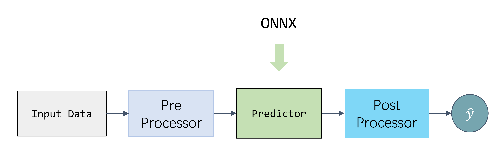

`carefree-learn` supports `onnx` export, but we need much more than just a [`Model`](../design-principles#model) (`predictor`) in production environment:



Fortunately, `carefree-learn` also supports exporting every part of this pipeline into a single zip file with one line of code. Let's first train a simple model on `iris` dataset:

```python
import cflearn
from cfdata.tabular import TabularDataset

x, y = TabularDataset.iris().xy
m = cflearn.make().fit(x, y)
```

After which we can pack everything up with `cflearn.Pack` API:

```python
cflearn.Pack.pack(m, "pack")
```

This will generate a `pack.zip` in the working directory with following file structure:

```text
|--- preprocessor
   |-- ...
|--- binary_config.json
|--- m.onnx
|--- output_names.json
|--- output_probabilities.txt
```

We can make inference with this `pack.zip` on our production environments / machines easily:

```python
import cflearn

predictor = cflearn.Pack.get_predictor("pack")
predictions = predictor.predict(x)
```


## Why Pack?

You might notice that both `cflearn.save` and `cflearn.Pack.pack` generate a zip file and both can be loaded for inference, so why should we introduce `cflearn.Pack`? The reason is that `cflearn.save` will save much more information than `cflearn.Pack`, which is not an ideal behaviour in production. For instance, `cflearn.save` will save several copies of the original data, while `cflearn.Pack` will simply save the core statistics used in pre-processors.

In fact, if we execute `cflearn.save(m, "saved")`, which will generated a `saved^_^fcnn.zip`, instead of `cflearn.Pack.pack(m, "pack")`, we'll see that the file size of `saved^_^fcnn.zip` is 18k while the file size of `pack.zip` is only 10k. This difference will grow linearly to the dataset size, because the file size of `pack.zip` won't change as long as the model structure remains unchanged, while the file size of `saved^_^fcnn.zip` depends heavily on the dataset size.


## AutoML in Production

As mentioned in the [AutoML](auto-ml.md) section, it is possible to pack all the trained models into a single zip file:

```python
auto.pack("pack")
```

This will generate a `pack.zip` in the working directory with following file structure:

```text
|--- __data__
   |-- ...
|--- fcnn
   |-- ...
|--- linear
   |-- ...
|--- ndt
   |-- ...
|--- nnb
   |-- ...
|--- tree_dnn
   |-- ...
|--- weights_mapping.json
```

We can make inference with this `pack.zip` on our production environments / machines easily:

```python
import cflearn

unpacked = cflearn.Auto.unpack("pack")
predictions = unpacked.pattern.predict(x)
```
